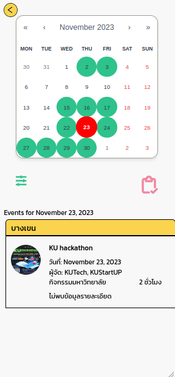
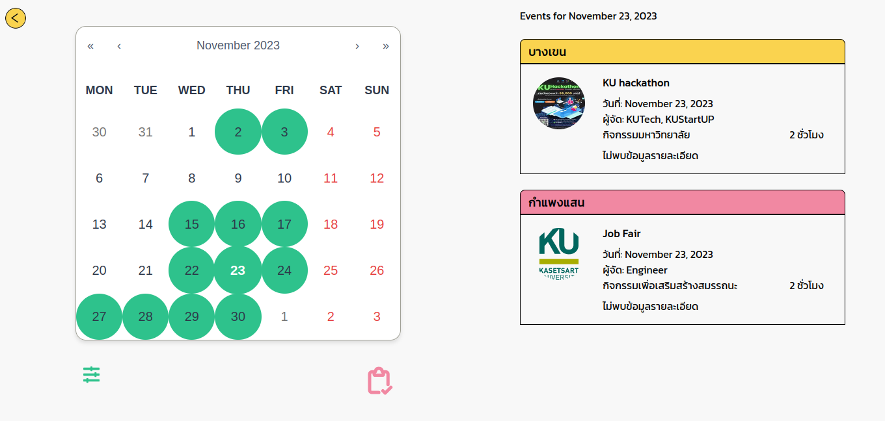
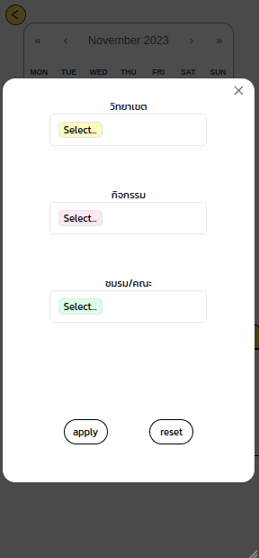
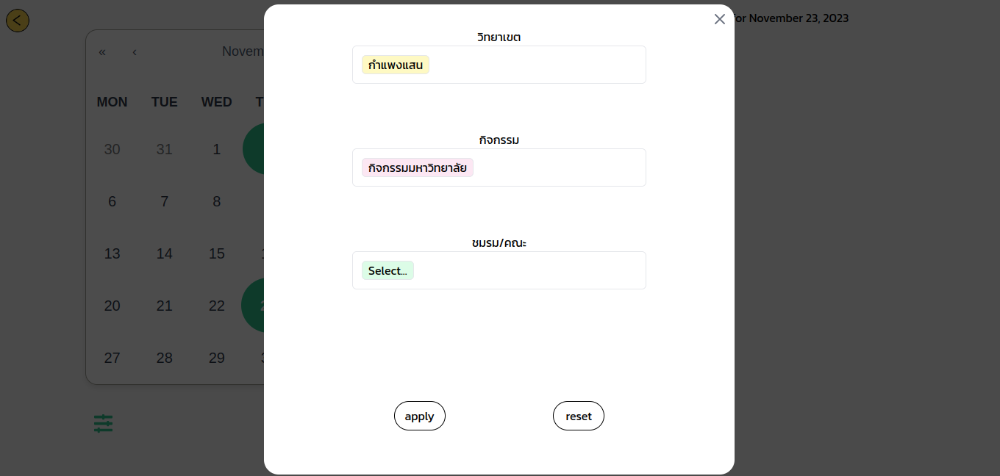
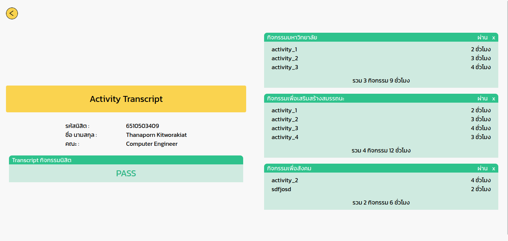
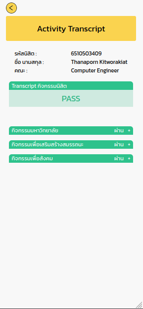

[](https://classroom.github.com/a/DRfJgED0)
# KU Hackathon 2023 
<p align="center">

</p>

รายละเอียดโครงการ : https://docs.google.com/document/d/1bn_71K9RF_K8MaBbZNgUAtS7PgFJkon91lOat7AtFxw/edit

<p>ชื่อ Feature : KUCalendar2.0 and Transcript2.0</p>
<p>Team Name : ที่จริงใจ</p>
<p>Team Member :</p>
<p>1.ปาณิสรา รัตนพฤกษ์</p>
<p>2.ปาลิดา มูลตรีมา</p>
<p>3.ภูวนัตถ์ เนียมหลวง</p>
<p>4.พัทธดนย์ ตันติเอมอร</p>
<p>5.ธนภรณ์ กิจวรเกียรติ</p>






<p>คำอธิบาย Feature : ปฎิทินกิจกรรมที่สามารถเพิ่มกิจกรรมจากหัวหน้าของหน่วยงานที่ต้องการจัดกิจกรรมได้ และมีฟิลเตอร์ที่ช่วยในการกรองเฉพาะกิจกรรมที่สนใจได้ หน้า Activity Transcript ใหม่ที่ช่วยสรุปข้อมูลที่นิสิตต้องการได้ในหน้าเดียว</p>

<p>Figma Design : https://www.figma.com/file/PEKIGVj0XvfGRTeA7duFvA/Design-(Copy)?type=design&node-id=0-1&mode=design&t=iHTrcL42b2KwLUYm-0</p>

คำสั่ง git พื้นฐานในการอัปโหลดโค้ดขึ้นมาที่ repository นี้


```bash
git add .
git commit -m "<commit_message>"
git push -u origin main
```
คำสั่ง run 
```bash
npm install
cd server
pip install -r requirement.txt
```